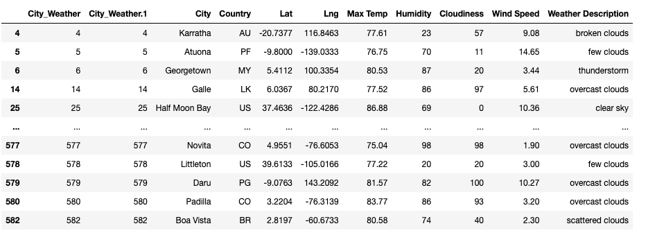
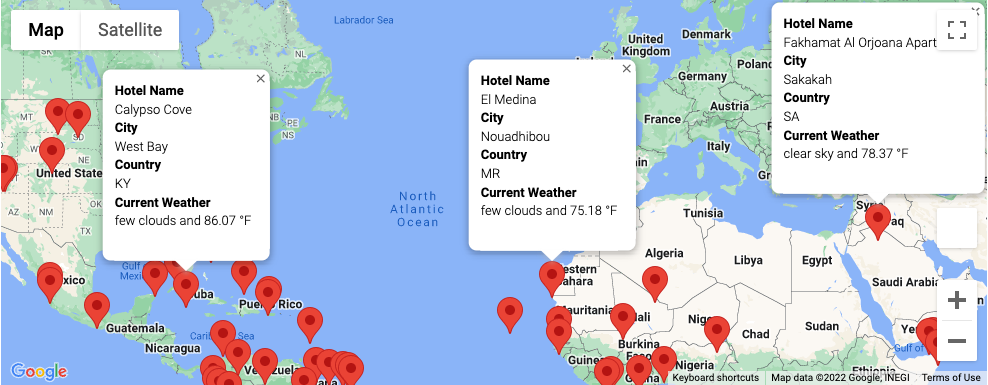
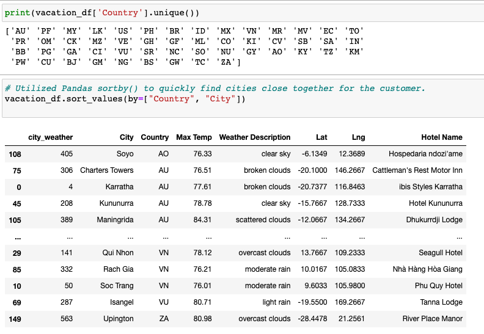
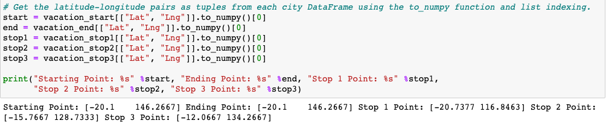
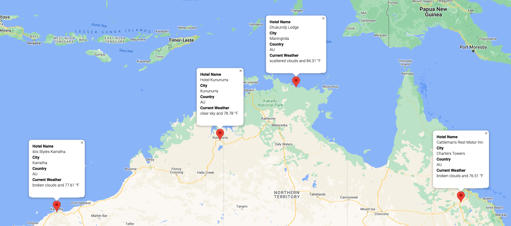

Tyrone Fraley
UC Berkley Extension
August 31, 2022

  

## Overview of the Project

Welcome to PLANMYTRIP! This is an extraordinary travel technology company that is at the top of their league! PLANMYTRIP focuses on internet-related services for the hotel and lodging industry. Interestingly enough, I worked with Jack who is a head analyist for PLANMYTRIP's user interface team. Jack asked me to assist him with collecting and presenting vacation information to our customers. The customers gave us their preferred travel destinations as well as desired weather conditions so that we may find the best spot for them to relax and enjoy life in a beautiful hotel, anywhere in the world!

Knowing the importance of the project. I quickly jumped into Jupyter Notebook, gathered more than 500 random latitude/longitude coordinates of cities from my CitiPy moodule, obtained Google Maps and OpenWeatherMap API keys, and finally collected JSON weather data from each city.

###Weather Database

During the analysis I generated a set of 2,000 random latitudinal and longitudinal coordinates. The reason was to find the nearest city and then perform an API call with OpenWeatherMap.The OpenWeatherMap API allowed me to gather current weather data for each city. Which in turn allowed me to create a data frame where I could see the weather from each city. To complete this task I imported Numpy, Pandas, CitiPy, my API key, Date Time, and Requests.

To generate the 2,000 random latitudes and longitudes I utilised the funcitions: *lats = np.random.uniform(low=-90.000, high=90.000, size=1500) and lngs = np.random.uniform(low=-180.000, high=180.000, size=1500)*. From here I created tuples containing the latitude and longitude combinations: *lat_lngs = zip(lats, lngs)*. After this point in the data collection process I created a for loop to identify the nearest city within each of the 2,000 coordinates. 

Later in the process i retrieved the following data from the API call: the latitude and longitude, Max temperature, % humidity, % cloudiness, wind speed, and the weather description (i.e. cloudy, fogy, light rain, etc.). To do this I created an empy list to hold the weather data (city_data = []). I then created a print messsage ("Begin Data Retrieval"). From here i st counterss to one and began the for loop process to loop through all cities in the list to catch weather data from each city. In addition, to previous work done on the *"city_data_df"* I ensured that "Weather Description" would be a column within the data frame. This would allow us to observe weather conditions for each city. Ultimately, this function was gathered dureing the *city_data_.append()* phase of the for loop and assigned within a dictionary. For further information on how this was coded, please refer to the *"Weather_Database_ipynb"* file to see how I coded the for loop. Finally, at the end of analyzing the data frame for the city_data I exported the script into a csv file to use later in my research process. 

  

###Vacation Search
To create the customer's travel destinations map it was important for me to employ input statements. These statements would allow the customer's prefferred temperatures to be identified within the data frame. Which would then allow me to identify travel destinations that the customer may want to go to, as well as nearby hotels to those destinations. 

To complete this task the same dependencies for the Weather Database were employed. To further my research I imported gmaps and my Google Maps API key. From this point I imported my *"WeatherPy_database.csv"* file to help me work in tandem with previous research.  

To gather the necessary weather information I first created input functions based on minimum and maximum temperature: *min_temp = float(input("Please enter the desired min temp")) & max_temp = float(input("Please enter the desired max temp"))*. I then created a new data frame from these functions within the *city_data_df* called *"preferred_cities_df"*. This would allow us the chance to identify key cities the customers would like to visit based on minimum and maximum temperatures, because the last thing we want to suggest is a city that is too cold or hot to the customer. 

Moving forward it was important to create a new data frame called *"clean_travel_cities"* which was generated from the *"preferred_cities_df"*, but null values were removed from the *"preferred_cities_df"* (preferred_cities_df.dropna()). At this phase of the analysis I could observe a data frame with zero null values. 

  

To gather hotel information I used the *.copy()* function to create a new data frame called *"hotel_df"*": *hotel_df = clean_travel_cities[["City", "Country", "Max Temp", "Weather Description", "Lat", "Lng"]].copy()*. This function was helpful because now I could identify hotels later in my map. Moving forward, after removing any null values in the *hotel_df* I exported the file as *"WeatherPy_Vacation.csv"* and then started to work on identifying locations through the use of this function: *"locations = clean_hotel_df[["Lat", "Lng"]]**. The newly developed locations data frame allowed me to later create markers with the help of gmaps (*gmaps.marker_layer()).

  

###Vacation Itinerary

The final step in the research process has begun! With the help of my previous work I am now able to identify key cities that may be potential destination spots for my customers. To properly finalize the results for the customers I used the Google Directions API to cultivate travel itinerary which would identify routes between four cities. In addition, my goal was to create a marker layer map with pop-u markers for each city on the itinerary for the customers. This is very exciting, so let's dive in!

Obtaining the Google Directions API was quick and easy. The process went as follows: navigate to the Google Cloud Platform, select "APIs & Services", select "Library", in the Search field I would type "Directions", select "Directions API", and finally click "Enable" to activate the Directions API. I then read the *"WeatherPy_vacation.csv"* data frame into a new data frame called *"vacation_df"*. Using the *gmaps.marker_layer()* function I began adding markers to my world map. To make the process a little more defined I took a quick deep dive into the countries within my data frame by using the following function: *"print(vacation_df['Country'].unique())"*. This was an important precursor to finding the four best destination points, because I wanted to be more specific in my research. I then organized the data frame so that I could see the cities and their countries in an organized fashion wihtin the data frame (alphabetical order). To do this I used the pandas *.sort_values()* function. It makes sense to follow this step because now I can not only see cities and countries organized in alphabetical order in my data frame, but I can also look at latitudinal and longitudinal coordinates to see which cities are close together without referring to my map. 

  

Australia was the winner on the potential travel destinations. I selected Charters Towers as the starting and ending city. With the following cities as destinations for the customers to travel to in order: Karratha, Kununurra, and Maningrida. All of these cities are close to the shore so the customers can enjoy Australia and it's ocean front. To plot their route I used numpy's *to_numpy()* function and list indexing to write codes to retrieve the coordinates. These coordinates were paired as tuples for each city in the data frame (i.e. *start = vacation_start[["Lat", "Lng"]].to_numpy()[0]*). 

  

The final step after plotting routes for the customer based on driving (*travel_mode="DRIVING"*). Was to refactor some of my previous code regarding hotel information and locations to be able to create a new marker layer map. This map displayed the cities and the travel routes for the customers. All in all this was an exciting project and I hope they enjoy their time in Australia.

  

References:

Images obtained through Google Images

